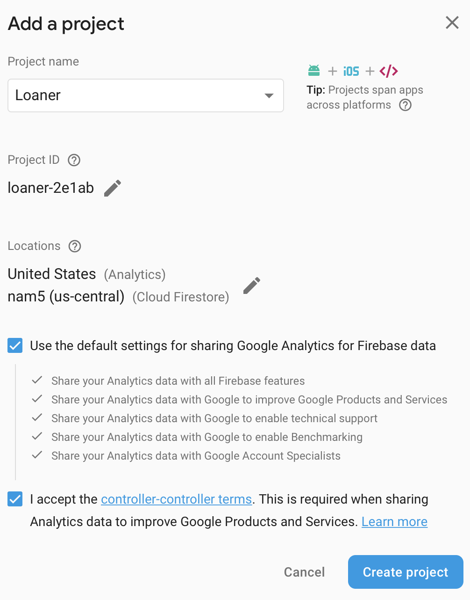
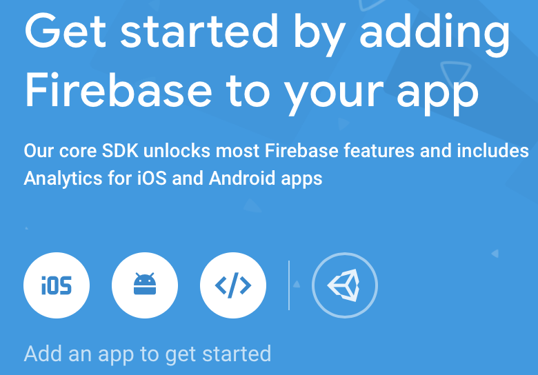

# Firebase + Loaner App - Guide

For this activity we will be using a pre-made project called [Loaner](https://github.com/Make-School-Labs/loaner/tree/05-Collection-Views). This app is meant to be used as a a means to track items that you have lent other people. You can keep track of these people using your contact list to get their information and then when they give you your item back, you can mark it as returned.

### Learning Objectives:

- Taking an existing app and make the necessary adjustments for it to integrate Firebase Database.
- Writing items to the Firebase Database.
- Fetching items from the database.
- Deleting items from the database.
- Editing items from the database.

### Setting up Firebase

Download the app here and explore the files.

Firebase setup

Go to the firebase console and add a new project.



This will take you to your new dashboard.
From there, follow the instructions on the first page to add your iOS app.



By the time you finish the 5 steps, you should now be using the .xcworkspace file for development and your project will have Firebase installed.

We are going to set up a database, you can find the option on the left menu.
Then scroll down to find the option "Create Real-Time Database". The Firestore option is new and later you can figure out how it differs from the one we'll use today.




To be able to use the database library in your project, we need another pod. Include `pod 'Firebase/Database'` in your podfile and run pod install again.

Ideally you would authenticate your users to have write permissions for the database. Just for this practice, we will change the rules in the database to let anyone read and write. You can change that later.

Go to the database and then choose the second tab Rules and change the values to true.

```
"rules": {
    ".read": true,
    ".write": true
  }
```

And that's it! you can now start using Firebase Database in you project.

### How data is stored in Firebase

You can think of data stored in Firebase as one large JSON file. All data is stored in objects that can hold key value pairs where value can be a string, number or another object. That's basically how it works, and that is one of the differences between Firebase Real-Time Database and Firestore. Firestore stores data in collections that in a hierarchical manner. Again, you can explore this other option as part of your individual iOS studies.

We need to care about how we structure data in Firebase to make our job easier and the documentation has good advice on how to do this. If you are planning on using Firebase for any of your projects, definitively follow the guidelines on this page:

[Tips on how to structure data in Firebase](https://firebase.google.com/docs/database/ios/structure-data)

These include:
- Avoid nesting data
- Flatten data structures
- Look for ways to build data that can scale

### Writing to the database

Now that you know how the current app operates, we need to save a few things.

To read or write data from the database, you need an instance of FIRDatabaseReference:

```
var ref: DatabaseReference!
ref = Database.database().reference()
```
This is how you would save a new item to the database:
```Swift
//Getting the reference to the database
var ref: DatabaseReference!
ref = Database.database().reference()

// Getting an autogenerated ID, this will be super useful to handle unique items every time and Firebase takes care of it.
let key = ref.child("items").childByAutoId().key

// Saving the data we'll send in a dictionary
let newItem = ["name": item.itemTitle,
               "notes": item.notes,
               "loanee": item.loanee?.contactInfo.identifier]

// Method from Firebase library that creates a new entry.        
ref.child("items").child(key!).setValue(newItem)
```
For simplicity, notice that we're only saving the id for the loanee.

As you can notice from the creation method, the way we navigate items in the database is similar to dot notation. We first get the reference, then look for the node "items", then look for the item by it's unique id, and finally set the values for it.

### Firebase Storage
So far, our method saves everything but the image. And this is something we must include. To deal with images we use Firebase Storage. You can find it in the left menu, below Database.

How it works is that it saves files in folders and you decide how to structure the folder hierarchy. For now we'll have a single folder called "items" and each image will have the key/id as the file name. Again, change the rules on the Storage so we can read and write without authenticating the user.

Changing the rules:
```
service firebase.storage {
  match /b/{bucket}/o {
    match /{allPaths=**} {
      allow read, write;
    }
  }
}
```

```Swift
func uploadProfileImage(_ image:UIImage, key: String, completion: @escaping ((_ url:URL?)->())) {
  let storageRef = Storage.storage().reference().child("items/\(key)")

  guard let imageData = UIImageJPEGRepresentation(image, 0.75) else { return }

  let metaData = StorageMetadata()
  metaData.contentType = "image/jpg"

  storageRef.putData(imageData, metadata: metaData) { metaData, error in
      if error == nil, metaData != nil {

          storageRef.downloadURL { url, error in
              completion(url)
          }
      } else {
          completion(nil)
      }
    }
}
```
Now you can see the image shows up in the Storage folder (Firebase's website).

But we also want to save a reference to that image we just uploaded in the item's entry. We need it to download the image in the app.

If you take a look at the method above, we are receiving the id of the object to store the image with that as a name. We can then at the same time, edit the item's entry by including the image field.

```Swift
var ref: DatabaseReference!
ref = Database.database().reference()
ref.child("items").child(key).updateChildValues(["imageUrl": url?.absoluteString])
```
This will not impact the rest of the item's information, it will simply add a new field to the node in the tree of data. Make sure to add the snippet of code when you retrieve the url, after the request is done.

### Retrieving data

So far we've only saved and edit data. It's time to move forward and get the entries to populate the first screen of the app.

You might have already an idea on how to do it, with the calls you've made. This is how it will look like:

```Swift
var ref: DatabaseReference!
ref = Database.database().reference().child("items")
ref.observe(DataEventType.value, with: { (snapshot) in
      self.items = []
      let postDict = snapshot.value as? [String : AnyObject] ?? [:]
      for rest in postDict{
            guard let restDict = rest.value as? [String: String ] else { continue }
            guard let name = restDict["name"],
                let notes = restDict["notes"],
                let url = restDict["imageUrl"],
                let loanee = restDict["loanee"] else { return }

            let person = Loanee(name: "", contactNumber: "")
            let item = Item(itemTitle: name, notes: notes, itemImage:url, loanee: person)
            self.items.append(item)
      }
  self.collectionView.reloadData()
})
```

This method will get triggered at first to get all the current items in the database and will also get called whenever a new item is added or changes. You might have already noticed that doing ` self.items = []` and then repopulating the array to reload the collectionview might be a little too much. There is amethod called `observeSingleEvent` that will only get the data from the database once, but for now this is the quickest way to demonstrate retrieving data in real time and updating new values. As a personal challenge, you can find a way to get only new data and append the new item to the collecvtionview. You will need to refer to the Firebase documentation to find a method you can use.

This automatic update in data is what makes Firebase great, it allows apps to have real time data and manage updates and changes accordingly.

To this point the app can now create a new entry, modify values and get real time updates. But there is still a lot more to fix.

- Once the item is created we need to dismiss the viewControllers to get bak to the main screen.
- There is a detail view when you select items from the first screen. This view has not been updated to use the correct data. You will need to handle the CNContact type to be able to call the person that has the loaned item.
- There is an option to mark the item as returned and also an option to delete the item. Both don't work yet. Get this functionality working with Firebase.

Helper function you might need:

```Swift
 func getContactWithID(contactID: String) -> CNContact {
        
        let predicate = CNContact.predicateForContacts(withIdentifiers: [contactID])
        let keys = [CNContactGivenNameKey, CNContactFamilyNameKey, CNContactEmailAddressesKey, CNContactPhoneNumbersKey]
        var contacts = [CNContact]()
        let contactsStore = CNContactStore()
        
        do {
            contacts = try contactsStore.unifiedContacts(matching: predicate, keysToFetch: keys as [CNKeyDescriptor])
            if contacts.count == 0 {
                print("No contacts found.")
            }
        }
        catch {
            print("Error fetching contacts.")
        }
        let contact = contacts[0]
        return contact
    }
 ```
