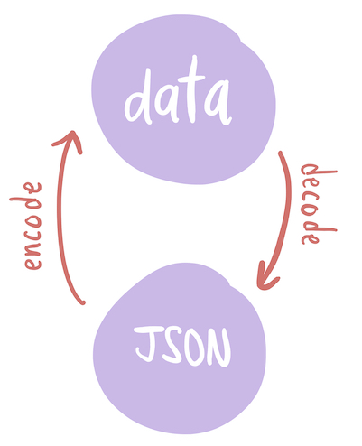

<!-- Run this slideshow via the following command: -->
<!-- reveal-md README.md -w -->


<!-- .slide: class="header" -->

# JSON and Swift

## [Slides](https://make-school-courses.github.io/MOB-1.3-Dynamic-iOS-Apps/Slides/Lesson6/README.html ':ignore')

<!-- > -->

## Why you should know this

Many applications receive information from a server. It doesn't matter how the implementation of handling the data happens, there's a **standard format** that can be recognized by every client app.

Years ago, **XML**(1996) was widely used for this purpose. But recent trends point that **JSON**(2002) has become the most popular data-interchange format and that it will continue to dominate the web.

<!-- > -->

## Learning Objectives

1. Identify JSON structures and create your own
1. Reading data from a file
1. Deserialize a JSON file
1. Turning data into objects using the Codable protocol

<!-- > -->

## JSON quick intro/review

JSON stands for JavaScript Object Notation. It is a lightweight data-interchange format that allows us to read and write data that machines can also generate and parse easily.

Two main structures:
- **Object:** Collection of name/value pairs.
- **Array:** Ordered list of values.

<!-- > -->

An object begins with a left brace and ends with a right brace. Each name is followed by colon and the pairs are separated by commas.


<!-- > -->

An array begins with a left bracket and ends with a right bracket. Values are separated by commas.


<!-- > -->

Values can be strings in double quotes, numbers, true, false, null, objects or arrays. Also, structures can be nested.


<!-- > -->

A string is a sequence of 0 or more characters in double quotes.


<!-- > -->

Numbers are regular numbers like any language.


<!-- > -->

In the end, JSON is a way of communicating using very specific rules that every entity involved can agree on.

<!-- > -->

### Example
```
{
   "festivals":[
      {
         "name":"Austin City Limits"
      },
      {
         "name":"Riot Fest"
      },
      {
         "name":"Coachella"
      }
   ]
}
```

<!-- > -->

## In Class Activity

Without using a format validator, create your own JSON file to represent a list of festivals. Include two festival entries. They do not have to be real.

Consider you have this structs as reference:

```Swift
struct Participant{
    let name: String
    let id: String
}

struct City{
    let name: String
    let id: String
}

enum FestivalType{
    case music
    case food
    case cinema
}

struct Festival{
    let date: Date
    let name: String
    let city: City
    let lineup: [Participant]
    let type: FestivalType
}
```

<!-- > -->

After you are done writing the structure use the [JSON validator](https://jsonformatter.curiousconcept.com) to make sure your format is correct. If not, do the necessary adjustments.

<!-- > -->

## Film Locations activity 🎬

Follow [this guide](https://github.com/Make-School-Courses/MOB-1.3-Dynamic-iOS-Apps/blob/master/Lessons/Lesson6/assignments/FilmLocations.md) to learn how to parse JSON and use it in an Xcode project.

<!-- > -->

## Encoding and Decoding



<aside class = "notes">
“Serializing a program’s internal data structures into some kind of data interchange format and vice versa is one of the most common programming tasks. Swift calls these operations encoding and decoding. One of the headline features of Swift 4 is a standardized design for encoding and decoding data that all custom types can opt into.”

Excerpt From: Chris Eidhof. “Advanced Swift.”
</aside>

<!-- > -->

What did we just do in the Film Locations project?

<!--decoded data into JSON-->

<!-- > -->

Types conform to the **Encodable** and/or **Decodable** protocols to state their ability to encode themselves and to create an instance from serialized data.

Most types will adapt both, so the standard library came up with a typealias for both: the **Codable** protocol.

```
public typealias Codable = Encodable & Decodable
```

<!-- > -->

#### Universality
Should work with structs, enums and classes.

#### Type safety
JSON is often weakly typed, but we're working with Swift so our code works with strongly typed data structures.

#### Reducing boilerplate
Writing less code, while the compiler generates what we need automatically.

<!-- > -->

When we have a value that conforms to the Codable protocol we can:

- Create an **encoder** to serialize the value into JSON. (**JSONEncoder** is built-in in Swift)
- Create a **decoder** that takes the serialized data and turns it into an instance of the original type. . (**JSONDecoder** is built-in in Swift)

Error handling is important during decoding. Many things can go wrong (missing fields, type mismatches, corrupted data, etc.)

<!-- > -->

## Example

Observe how encoding/decoding works in [this example](https://github.com/Make-School-Courses/MOB-1.3-Dynamic-iOS-Apps/blob/master/Lessons/Lesson6/assignments/example.md)

<!-- > -->

### Coding Keys
We can control how a type encodes itself by writing a custom CodingKeys enum.

- **Rename** fields by giving string values
- **Skip** fields by omitting keys

<!-- > -->

## Using the Codable Protocol

Follow [this guide](https://github.com/Make-School-Courses/MOB-1.3-Dynamic-iOS-Apps/blob/master/Lessons/Lesson6/assignments/Codable.md) to practice how to use the Codable protocol.

<!-- > -->

## Generating structs

This time we created our structs from scratch to understand where everything comes from.

In the future, if you are given the JSON data to review it first, you can generate the struct file automatically with this tool:

[quicktype.io](https://app.quicktype.io)

Try pasting the `locations.json` content in there and compare your implementation with the autogenerated one. It can definitely serve as a starting point 😉

<!-- > -->

## Lab time

Practice your new skill! 🤩

Take the JSON file [Festivals](assets/festivals.json) and create a project where you decode the contents to display The name of the Festival, the date and the number of artists in the lineup in a TableViewCell.

<!-- > -->

## Practice questions

**Q:** How does the encoding process work?<br>
**Q:** What does the compiler handle when using Codable?<br>
**Q:** How does the decoding process work?<br>
**Q:** What are coding keys? How are they useful?<br>

<!-- > -->

## Additional Resources

1. [XML vs JSON](https://www.cs.tufts.edu/comp/150IDS/final_papers/tstras01.1/FinalReport/FinalReport.html)
1. [JSON documentation](http://www.json.org)
1. [JSON format validator](https://jsonformatter.curiousconcept.com)
1. [Film locations](https://data.sfgov.org/Culture-and-Recreation/Film-Locations-in-San-Francisco/yitu-d5am)
1. [Codable sheet](https://www.hackingwithswift.com/articles/119/codable-cheat-sheet)
1. (Book) “Advanced Swift.” by Chris Eidhof
1.[Medium article](https://medium.com/flawless-app-stories/lets-parse-the-json-like-a-boss-with-swift-codable-protocol-3d4c4290c104)
