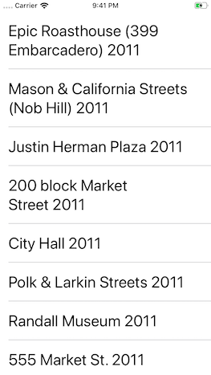

# Using the Codable Protocol

We will keep on working with our Film Locations project. So just in case you haven't pushed it, do it now. You will need to demonstrate both implementations with your commit history. 🤓

#### 1. FilmEntryCodable

Create a new file and call it struct `FilmEntryCodable`. This will be the same as our current `FilmEntry` but we will do it separately so you can keep both implementations.

```swift
struct FilmEntryCodable : Codable{
    var firstActor: String
    var locations: String
    var releaseYear: String
    var title: String
}
```

The only difference so far is that we are conforming to the Codable protocol. Let's see how that's useful.

#### 2. Using JSONDecoder

```swift
func getDataFromFile(_ fileName:String){
    let path = Bundle.main.path(forResource: fileName, ofType: ".json")
    if let path = path {
        let url = URL(fileURLWithPath: path)
        let contents = try? Data(contentsOf: url)
        if let data = contents{
            let decoder = JSONDecoder()
            do {
                let filmsFromJSON = try decoder.decode([FilmEntryCodable].self, from: data)
                films = filmsFromJSON
                tableView.reloadData()
            } catch {
                print("Parsing Failed")
            }
        }
    }
}
```

Our `getDataFromFile` method will change to use JSONDecoder now. And instead of telling the program that we are getting an array of Dictionaries, we now say we are expecting an array of `FilmEntryCodable`. This is a lot more readable and easy to understand.

Run the app and see if our table still works.

Its blank! Where did everything go?

#### 3. Bad naming

The first issue with our attempt is that the names of our properties don't match the ones from the JSON structure. For instance, `firstActor` is not the same as `actor_1`.

To solve this, we can use CodingKeys. This goes inside the struct.

```swift
enum CodingKeys:String,CodingKey
{
  case firstActor = "actor_1"
}
```

#### 4. 🐫 vs  🐍

In our code we follow camel case convention. But the JSON we get back is using snake case.

This can easily be fixed by setting a `keyDecodingStrategy` to the decoder.

```swift
let decoder = JSONDecoder()
decoder.keyDecodingStrategy = .convertFromSnakeCase
```

If we run it, still nothing. ☹️

### 5. Missing keys

The Codable protocol is trying to parse all the properties we have in our struct, but remember sometimes not all of them are available. To fix that we can create an initializer that sets default values for the ones missing.

First I find useful to update the coding keys to all the parameters we need

```swift
enum CodingKeys:String,CodingKey
{
  case firstActor = "actor1"
  case locations = "locations"
  case releaseYear = "releaseYear"
  case title = "title"
}
```

Note that since we have the `keyDecodingStrategy` set, I wrote the coding keys as if that already had made effect.

Then create the initializer.

```swift
init(from decoder: Decoder) throws{
    let container = try decoder.container(keyedBy: CodingKeys.self)
    firstActor = (try container.decodeIfPresent(String.self, forKey: .firstActor)) ?? "Unknown"
    locations = (try container.decodeIfPresent(String.self, forKey: .locations)) ?? "Unknown Location"
    releaseYear = (try container.decodeIfPresent(String.self, forKey: .releaseYear)) ?? "Unknown Year"
    title = (try container.decodeIfPresent(String.self, forKey: .title)) ?? "Unknown Title"
}
```

Try it now and you should see it working 😀

**This is a good time to commit and push.**

#### 6. Unexpected data types

Here's a scenario that you might find yourself in in the future. Our structure has the property `releaseYear` as a String. But it could be the case that the server sends it back as Int, and because it's a mismatch in types, our app will fail to decode it.

Here's how we can handle it.

```swift
enum MultiType:Codable{

    func encode(to encoder: Encoder) throws {

    }

    case int(Int)
    case string(String)

    init(from decoder: Decoder) throws {
        if let intValue = try? decoder.singleValueContainer().decode(Int.self)  {
            self = .int(intValue)
            return
        }
        if let stringValue = try? decoder.singleValueContainer().decode(String.self){
            self = .string(stringValue)
            return
        }
        throw MultiType.missingValue
    }


    enum MultiType: Error {
        case missingValue
    }
}

extension MultiType {
    var value: String {
        switch self {
        case .int(let intvalue):
            return String(intvalue)
        case .string(let stringValue):
            return stringValue
        }
    }

}
```

Adding a new enum that can be either an Int or a String. Depending on what it can decode, it gets initialized with the correct type. The extension at the end lets us always get the value as a String, regardless the original type.

Then we change the type of `releaseYear`:

```swift
var releaseYear: MultiType
```

We also change how we decode it:

```swift
releaseYear = (try container.decodeIfPresent(MultiType.self, forKey: .releaseYear)) ?? MultiType.string("Unknown year")
```

And we can try to see if it works by showing it in the cell:

```swift
cell.textLabel?.text = film.locations + " " + film.releaseYear.value
```

**This is a good time to commit and push.**



Sources:

- [Medium article](https://medium.com/flawless-app-stories/lets-parse-the-json-like-a-boss-with-swift-codable-protocol-3d4c4290c104)
- [Codable cheat sheet](https://www.hackingwithswift.com/articles/119/codable-cheat-sheet)
