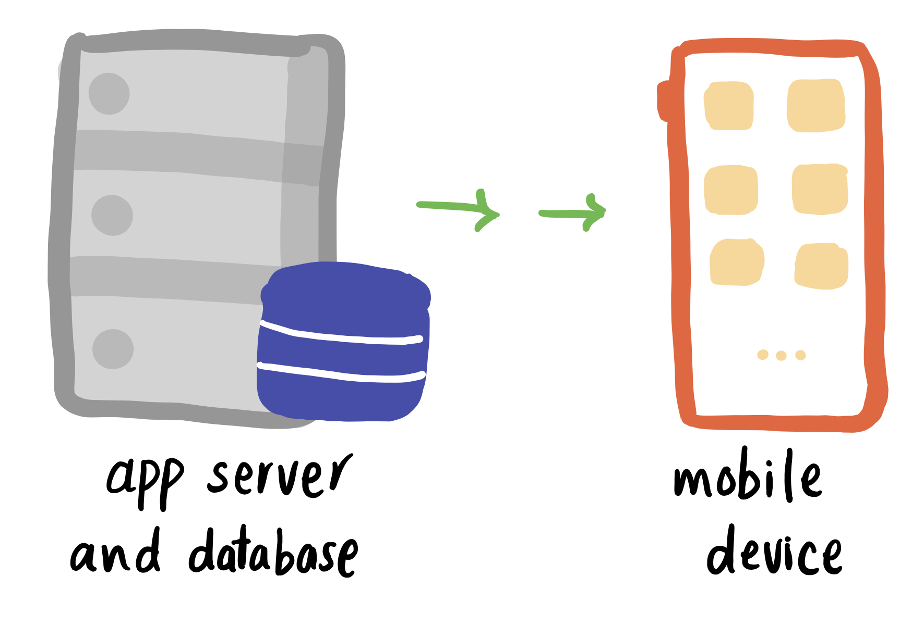
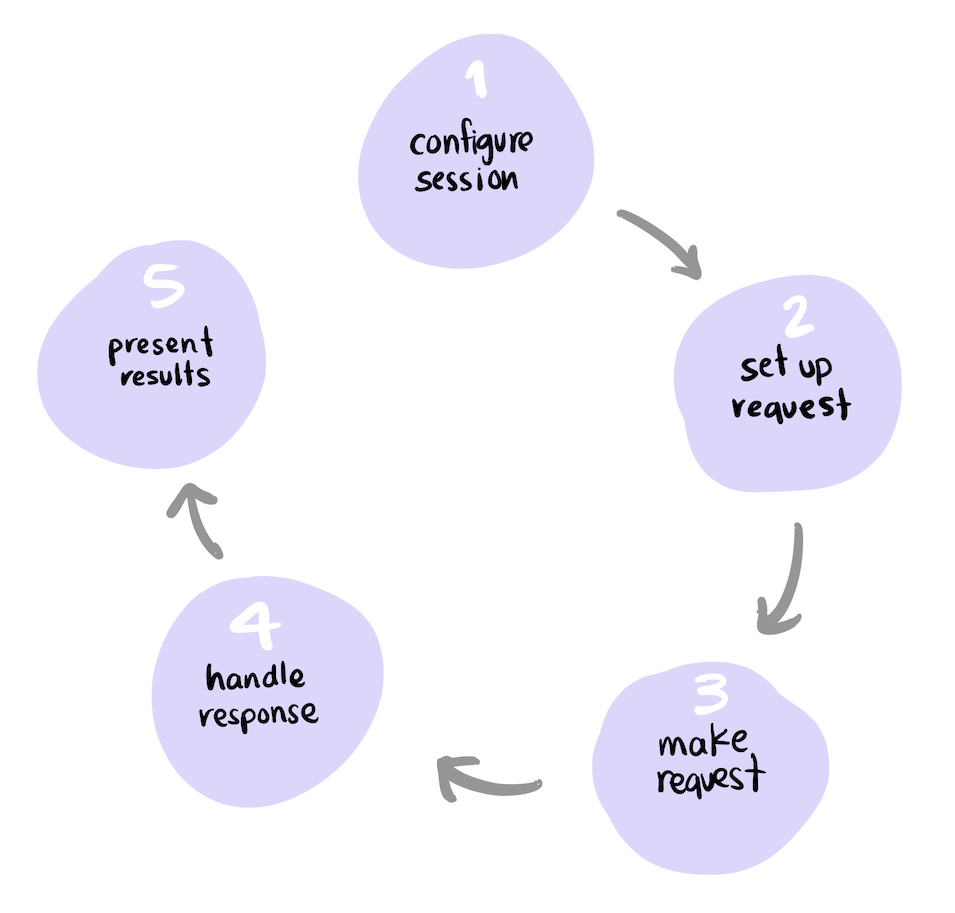
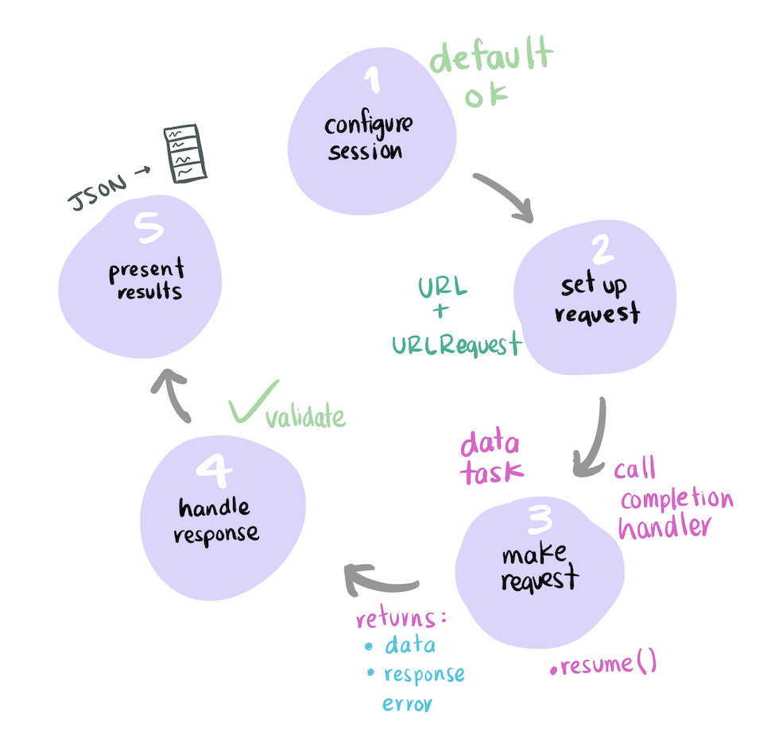

<!-- Run this slideshow via the following command: -->
<!-- reveal-md README.md -w -->


<!-- .slide: class="header" -->

# Network Requests using URLRequest

## [Slides](https://make-school-courses.github.io/MOB-1.3-Dynamic-iOS-Apps/Slides/URLSession/README.html ':ignore')

<!-- > -->

## Why you should know this



<aside class="notes">
Nearly every iOS app communicates at some point with an Internet component such as a remote web service.

Fetching and processing data between an app and a web service is an essential skill that all iOS developers must master.

And the most commonly-used protocol for communicating with web servers is **HTTP** (and its secure counterpart, HTTPS).

Since iOS 7, Apple has provided **URLSession** and its suite of related components as **a complete networking API** for uploading or downloading content via **HTTP** and HTTPS.
</aside>

<!--
...and its family of related classes...

**HTTP** and **HTTPS** are robust and stable protocols. They have been widely used in web browsers for a long time. They offer several performance and security advantages, as well as a mature base of easy-to-use development and analysis tools.

to make GET and POST network requests...
-->

<!-- > -->

## Learning Objectives

At the end of this class, you should be able to...

1. Implement a simple HTTP-based request to a public Internet API using the primary components of URLSession.
2. Use Xcode's built-in features to research properties and behaviors of Foundation framework data types (e.g., URLSession classes, methods and properties).
3. Validate HTTP response data and guard against common HTTP error conditions.
4. Display text and images fetched from free web services.
5. Use JSONSerialization to convert binary Data objects into JSON data.

<!-- > -->

## URLSession

 </br>

<aside class="notes">
URLSession is responsible for sending and receiving HTTP requests.

Like most networking APIs, the URLSession API is highly asynchronous.
</aside>

<!-- > -->

### URLSessionConfiguration

Every URLSession instance is initialized using an `URLSessionConfiguration object`, which defines the behavior and policies to use when uploading and downloading data.

URLSessionConfiguration will also let you configure additional HTTP headers, timeout values, caching policies, and other session properties.

<!-- > -->

#### Three types:

URLSessionConfiguration objects come in 3 flavors:

1. **.default** - Creates a default configuration object that uses the disk-persisted global cache, credential and cookie storage objects. Can save cache or cookies to disk, credentials to the Keychain.

<!-- v -->

2. **.ephemeral** - Similar to `.default`, but all session-related data is stored in memory and will be gone once the session terminates.

<!-- v -->

3. **.background** -  Allows the session to perform upload or download tasks in the background, even if the app is suspended.

<!-- > -->

Here is a simple example of a declaration of a `URLSession` instance using the `.default` `URLSessionConfiguration` type:

``` Swift
let defaultSession = URLSession(configuration: .default)
```

<!-- > -->

### URLSessionTask

To do the real work of fetching data or downloading/uploading files, a session creates one or more *tasks.*

`URLSessionTask` is the *abstract class* which contains predefined network task behaviors.

 </br>

<!-- > -->

#### Three types:
The three concrete subclasses of URLSessionTask which you will employ most often are:

1. **URLSessionDataTask** - Intended for short, often interactive server requests such as fetching data by sending HTTP requests (GET, POST, etc). Data tasks send and receive data using `NSData` objects.

<!-- v -->

2. **URLSessionUploadTask** - Similar to data tasks, but also send data (such as a file) from disk to web service, and they support background uploads while the app is no longer running.

<!-- v -->

3. **URLSessionDownloadTask** - Data from a remote service is retrieved in the form of a file and stored in a temporary location. Supports background downloads/uploads while app the isn't running.

<!-- > -->

## Making HTTP GET Requests Using URLSessionDataTask



<aside class = "notes">
The following steps show how to create, send and validate a simple HTTP GET request using a URLRequest object and a URLSessionDataTask instance that returns its URLResponse via a completion handler.
</aside>

<!-- > -->

### 1. Configure the Session

Configuring your `URLSession` object can be as simple as writing a single-line declaration, or you can specify a complex set of conditions and parameters to control your session's state and behavior.

The following code illustrates a complex set of configuration parameters applied to a session defined as a `.background` session:

``` Swift
private lazy var urlSession: URLSession = {
    let config = URLSessionConfiguration.background(withIdentifier: "MySession")
    config.isDiscretionary = true
    config.sessionSendsLaunchEvents = true
    return URLSession(configuration: config, delegate: self, delegateQueue: nil)
}()
```

<!-- > -->

For this lesson, we will only work with a simple, one-line `.default` session configuration:

``` Swift
let defaultSession = URLSession(configuration: .default)
```

<!-- > -->

### 2. Set Up the Request

#### Create the URL Object

The `URL` class defines a local or remote [URI](https://en.wikipedia.org/wiki/Uniform_Resource_Identifier). It could be a link to a remote HTML webpage, a local file accessed using `file:///` or any other item qualifying as a `URI.`

```swift
// Create URL
let url = URL(string: "https://<your_target_web_service>")
```

<!-- > -->

#### Create the URLRequest Object

Though it is possible to send a very simple request, the `URLRequest` object represents a URL and offers configuration parameters for setting the request's **body, headers, and access method** (GET, POST, etc).

There are various constructor signatures available for creating `URLRequest` objects. This one only requires a valid URL object as its single argument:

```swift
// Create Request
let request = URLRequest(url: url!)
```

<!-- > -->

### 3. Make the Request

#### The Data Task

To make a request, you create an instance of the `URLSessionDataTask` class, pass it your `URLRequest/URL,` and call its completion handler.

```swift
...
// Create Data Task
let dataTask = defaultSession.dataTask(with: request, completionHandler: { (data, response, error) -> Void in

  // handle Response Here

})
...
```

The `completion handler` is a closure that is executed when your data task is finished and the response to your request has been returned.

<!-- > -->

##### The Objects Returned

Let's take a moment to examine the `data,` `response,` and `error` objects returned when the data task's completion handler finishes:

```swift
let dataTask = defaultSession.dataTask(with: request, completionHandler: { (data, response, error) ->
...
```

<!-- v -->

- `data` - Is an object of type `Data` (aka, `NSData`). NSData objects encapsulate data in a binary format. To manipulate or present its contents, we will have to convert it to a more human-readable format (i.e, JSON).

<!-- v -->

- `response` - Is of type `NSHTTPURLResponse,` which is a subclass of `URLResponse.` It contains useful data about the response itself that often comes in handy when analyzing success or failure of a specfic request.

<!-- v -->

- `error` - Behind this object is a simple `enum` listed in the official framework docs as "A type representing an error value that can be thrown." If the request is *not* successful, this `error` object will be passed to the completion handler. When the request is successful, this will be `nil.` *(Though we'll see later that the request can still fail, at some level, even if the `error` object is `nil` after the data task completes.)*

<!-- > -->

#### The .resume() function

At this point, your network request has only been set up. To execute it, you'll need to start it.

By **default**, Apple has set up all newly-initialized tasks to begin in a **suspended state.** So you need to call the `.resume()` function on a task in order to start it.

<!-- > -->

#### The Full Request

Except for handling the response, this code snippet depicts the complete set of steps required to make our simple GET request:

``` Swift

  func someDataFetchFunction() {

        // Configure a .default session
        let defaultSession = URLSession(configuration: .default)

        // Create URL
        let url = URL(string: "https://<your_target_web_service>")

        // Create Request
        let request = URLRequest(url: url!)

        // Create Data Task
        let dataTask = defaultSession.dataTask(with: request, completionHandler: { (data, response, error) -> Void in

          // handle Response Here

        })
        dataTask.resume() // Start the data task
    }
```

<!-- > -->

### 4. Handle the Response

When the `completion handler` closure is executed, you can validate the data returned and process it for presentation to the user, or whatever your app needs to do with it.

<!-- > -->

#### URLResponse Object

The counterpart to the URLRequest object, the `URLResponse` object is returned when the `completion handler` closure successfully executes.

It contains valuable info about the response returned, including:
- the HTTP Status Code
- the HTTP headers

<!-- > -->

### 5. Present Results  

Typically, you will want to process and present the JSON data returned from the GET request.

But before we examine how to *serialize/deserialize* the JSON object returned, we'll simply use `print()` statements to examine and confirm what is returned from our request.

```swift
// Create Data Task
let dataTask = defaultSession.dataTask(with: request, completionHandler: { (data, response, error) -> Void in
    print("data is: ", data!)
    print("response is: ", response!)
})
```

Once we are clear on the steps required to process the returned JSON data, we will be set up to present our returned data to the user (using tables, collection views, image galleries, etc.)

<!-- > -->

## NASA's picture of the day 🪐

Follow instructions [here](https://github.com/Make-School-Courses/MOB-1.3-Dynamic-iOS-Apps/blob/master/Lessons/Lesson7/assignments/nasa.md).

<!-- > -->

## Validate and Process the Response

### Validate the Response

When making network requests with HTTP/S, success or failure can occur at several levels:
- Any errors with the Response?
- Was the expected HTTP Status Code returned?
- Was data returned in the correct format?
- Was a data object returned at all?

<!-- > -->

Handling errors and validating successful state are key to working with the URLSession family of classes and functions.

**Developer Hints:**
- Whether or not all the procedures listed are required or optional depends on your particular implementation of URLSession.
- However, **handling the error** returned and **converting JSON data** should always be considered as **required** steps .

<!-- > -->

### Handle the `error` Object

Check if the `error` object is `nil.` If not, *properly* handle the error (for now, we'll simply print the error returned):

```swift
// guard against any errors with this HTTP response
guard error == nil else {
  print ("error: ", error!)
  return
}
```

<!-- > -->

### Confirm the Data Object

Ensure that a `data` object has been returned with the response:

```swift
// protect against no data returned from HTTP response...
guard data != nil else {
  print("No data object")
  return
}
```

<!-- > -->

### Validate HTTP Status

Confirm that the HTTP Status Code returned falls within the range of acceptable codes. If not, we want to properly respond to the error condition:

```swift
// Confirm the HTTP Status Code is within the range of acceptable ones
guard let httpResponse = response as? HTTPURLResponse, (200...299).contains(httpResponse.statusCode) else {
    print("response is: ", response!)
    return
}
```

<!-- > -->

### Format Validation

Now that we know the response status is good, we can validate the format of the returned data.

The `MIME Type,` a value returned by most web servers, tells us the **format** of the returned data. We want to ensure that the data returned is in the expected format (JSON, in this case):

```swift
// Validate response data is in expected format
guard let mime = response?.mimeType, mime == "application/json" else {
  print("Wrong MIME type!")
  return
}
```

<!-- > -->

### JSON Serialization of HTTP Responses

Finally, we want to convert (*deserialize*) the binary data object returned into a JSON object that we can process as a Swift collection object (a dictionary or an array).

And we want to properly respond to potential errors by wrapping our JSONSerialization work in a `do-try-catch` block:

```swift
...
// Convert response data to JSON
  do {
      let jsonObject = try JSONSerialization.jsonObject(with: data!, options: [])
        print(jsonObject)
      } catch {
          print("JSON error: \(error.localizedDescription)")
      }
```

<!-- > -->



<!-- > -->


## HW assignment (lab suggestion)

[Practicing requests with SWAPI](https://github.com/Make-School-Courses/MOB-1.3-Dynamic-iOS-Apps/blob/master/Lessons/Lesson7/assignments/swapi.md)

<!-- > -->

## Interview question

1. `URLSession` objects are *asynchronous.* Research what that means and be able to answer the following question:
- Why did we need to add the following call to `main.async` when presenting the image in **Activity 1**:

```swift
DispatchQueue.main.async {
  //TODO: Insert downloaded image into imageView
}
```

<!-- > -->

## Additional Resources

1. [Slides](https://docs.google.com/presentation/d/1Jy_81HTTE-3atStXg6hQdYDr9jIaa6tkYvNlkfibQvY/edit?usp=sharing)
2. [URL Loading System - from Apple](https://developer.apple.com/documentation/foundation/url_loading_system)
3. [URLSession - from Apple](https://developer.apple.com/documentation/foundation/urlsession)
4. [The URLSessionDelegate Protocol - from Apple](https://developer.apple.com/documentation/foundation/urlsessiondelegate)
5. Asynchronicity and URL Sessions:</br>
[From Apple](https://developer.apple.com/documentation/foundation/urlsession)</br>
[From StackOverflow](https://stackoverflow.com/questions/45463996/how-does-urlsessiontask-run)
4. [Error Error Handling In Swift With Do-Try-Catch - an article](https://learnappmaking.com/error-handling-swift-do-try-catch/)
