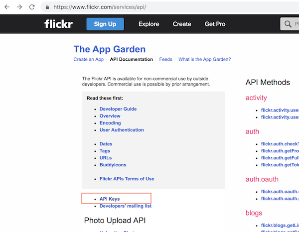

# Requests with Authentication

## Minute-by-Minute

| **Elapsed** | **Time**  | **Activity**                        |
| ----------- | --------- | ----------------------------------- |
| 0:00        | 0:05      | Objectives                          |
| 0:xx        | 0:xx      | Initial Exercise                    |
| 0:x        | 0:xx      | BREAK                               |
| 0:x        | 0:x      | In Class Activity I                 |
| xxx      | 0:40      | Cumulative Review |
| 1:35        | 0:20      | In Class Activity II                |
| 1:45        | 0:05      | Wrap Up                             |
| TOTAL       | 1:50      |                                     |

<!-- NOTE -- 40 minutes of this class will be for review of student projects -->

## Why you should know this

As the use of the **HTTP protocol** evolved, so have the efforts of Internet bad guys to exploit its **many inherent weaknesses** for their own nefarious ends.

In fact, HTTP is such an insecure protocol that Apple has all but prohibited its use in iOS apps.

Over the last few releases of iOS, Apple has redesigned iOS's networking frameworks to work natively with **HTTP's secure counterpart: HTTPS.**

And the primary difference between HTTPS and HTTP?

- *HTTPS requires Authentication.*

Thus, every iOS developer *must* know how to implement HTTPS-based network calls with Authentication.

<!-- TODO: find exact date and iOS version in which Apple made this changes -->

## Class Learning Objectives/Competencies (5 min)

1. xx

## Initial Exercise (15 min)

**Structured Sharing Exercise - Part 3 from last class**

- Come up and review the sheets from last class.
- Select the one or two sheets you agree with most.

In Groups of 3 - (8 min)
- Share your thoughts about your selection.

As A Class - (6 min)
- We'll choose 3 review topics. Volunteers to explain each.

## Network Authentication for iOS

There can be a variety of options for securing network communications over HTTPS, ranging from very simple to complex ones such as SAML or OAUTH login implementations.

And Internet security techologies

And, as an iOS developer, you will want to know more about those security strategies.

But to start out, we will focus on the simplest and very commonly used

Authentication for HTTPS comes in two distinct implementation types:

- OAUTH - Is an "authorization framework enables third-party applications to obtain limited access to a web service." []
- API Keys

<!-- TOODO: research and briefly explain each type -->

### OAUTH

### API Keys

## In Class Activity I (20 min)

Resources needed:
- Download [The PhotoMatic starter app](https://github.com/VanderDev1/PhotoMatic_Starter.git)
- An API Key for the Flickr photo web service
- The Flickr webservice endpoint URL and the name of the method required to access Flickr's free library of Interesting Photos.

### Part 1 - Individual

For this activity, we are going to access the Flickr photo sharing and management web service.

But we'll need to obtain an API KEY from Flickr. Here's how:

#### FIRST STEP: Create A Flickr Account

1. Access the [Flickr API main page](https://www.flickr.com/services/api/)

2. Then click on the API Keys URL to bring up the Login screen:

3. Find and select the `Not a Flickr member? Sign up here.` link at the bottom of the Login dialog box
- Then, click the `I want to create a new Yahoo email address` and *use your Make School email address.*
*Note: This interface is a little goofy, so ensure all fields are as you intend them to be before choosing `Continue.`*

4. After you create your account, you will need to API Keys URL again to apply for a key.

5. When prompted with the obvious page, choose "Apply For Non-Commercial Key"

...and you should be presented with your brand-new, Flickr API Key!

### Part 2 - As A class

For this exercise, we need:

- [The PhotoMatic starter app](https://github.com/VanderDev1/PhotoMatic_Starter.git)
- A valid Flickr API Key
- The base url for the Flickr API:
https://api.flickr.com/services/rest
- The Flickr method to call to download Interesting Photos

...and one student volunteer to "drive"

<!-- TOODO: at end of activity, in prep for next lessons, have pupils give opinions on the construction of the VC -- as i MVC >

## Cumulative Review (40) min)

<!-- xxx -->

<!-- xxx -->

## In Class Activity X (xx min)

## Challenges

1.

## Wrap Up (5 mins)

## Additional Resources

1. [Slides](https://docs.google.com/presentation/d/18RCyeINXP1lyrqAj0tTBmJrDD9z28ch5AF2iKNBTpss/edit?usp=sharing)
2. [xxx]()

https://hackernoon.com/mobile-api-security-techniques-682a5da4fe10
